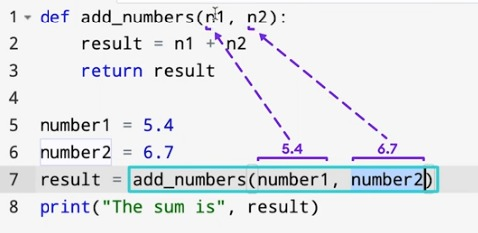
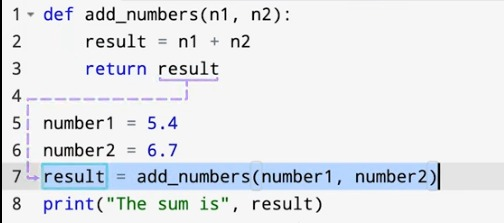

# Functions and the `return` Keyword in Python

## Functions in Python

A **function** in Python is a reusable block of code designed to perform a specific task. Functions help in structuring code efficiently, reducing redundancy, and improving maintainability.

### Defining a Function
A function is defined using the `def` keyword, followed by the function name and parentheses containing optional parameters.

```python
# Function definition
def greet(name):   #parameters
    print("Hello, " + name + "!")

# Function call
greet("Alice")  #arguments
```

### Function Parameters
Functions can accept arguments (parameters) to process data dynamically.

```python
def add_numbers(a, b):  #parameters
    sum = a + b
    print("Sum:", sum)

add_numbers(5, 3) #arguments  # Output: Sum: 8. 
```

## The `return` Keyword
The `return` keyword is used in a function to return a value back to the caller. It allows functions to produce outputs that can be used elsewhere in the program.

### Example of `return`
```python
def multiply(a, b):
    return a * b  # Returns the product of a and b

result = multiply(4, 5)
print("Result:", result)  # Output: Result: 20
```



### Importance of `return`
- Allows functions to send results back to the caller.
- Enables further processing of the returned value.
- Without `return`, functions return `None` by default.

### Returning Multiple Values
Python functions can return multiple values using tuples.

```python
def calculate(a, b):
    sum = a + b
    product = a * b
    return sum, product  # Returning multiple values

s, p = calculate(3, 4)
print("Sum:", s, "Product:", p)  # Output: Sum: 7 Product: 12
```

## Summary
- **Functions** help organize code by encapsulating reusable logic.
- **Parameters** allow functions to work with different inputs.
- **The `return` keyword** enables functions to send data back for further use.
- Functions **without `return`** return `None` by default.
- Python allows **multiple return values** using tuples.


